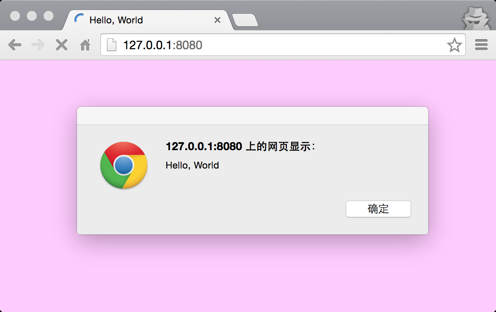

## 从零开始

从零开启一个 FIS3 项目，并学习 FIS3 如何使用。

### 目录

- [开始一个小项目](#开始一个小项目)
- [静态资源压缩](#静态资源压缩)
- [修改静态资源发布路径](#修改静态资源发布路径)


### 开始一个小项目

- 创建项目目录
    
    ```bash
    $ mkdir my-proj
    ```

- 在项目中新建配置文件

    *在 fis3 中，文件处理流程都以配置文件为主，所以配置文件是必须要有的*
    ```bash
    $ cd my-proj #进入项目目录
    $ echo '' > fis-conf.js #最初为空即可
    ```
    
通过以上两步，我们建了一个空的 `fis3` 项目

```
my-proj/
my-proj/fis-conf.js
```

现在我们要开始写代码了，我们需要完成以下几个任务；

新建一个页面 `index.html` 并且引入样式文件 `style.css` 和 JS 脚本文件 `app.js`。并且发布这个项目，查看结果。

```
my-proj/index.html
my-proj/style.css
my-proj/app.js
my-proj/fis-conf.js
```

- 写代码

    *index.html*
    
    ```html
    <!DOCTYPE html>
    <html>
        <head>
            <title>Hello, world</title>
            <link rel="stylesheet" href="./style.css">
        </head>
        <body>
            <script type="text/javascript" src="./app.js"></script>
        </body>
    </html>
    ```
    
    *style.css*
    
    ```css
    body {
        background-color: #FFCCFF;
    }
    ```
    
    *app.js*
    ```
    alert("Hello, World");
    ```

- 发布项目

    ```bash
    $ cd my-proj
    $ fis3 release
    ```
    
    > `fis3 release -d <dest>` 通过 `-d` 参数指定产出目录，如果未制定并且 `fis-conf.js` 未配置 `deploy` 属性，则文件默认被发布到 `fis3 server open` 打开的目录
    
- 查看发布的结果

    ```
    fis3 server start
    ```
    > 默认启动 `node` 的调试服务器，默认开启端口 `8080`
    
    执行以上命令，会自动启动本地调试服务，并且打开默认浏览器访问 `http://127.0.0.1:8080` 地址
    
    


通过以上三步，我们的简易项目发布成功了，而且运行也很 OK。得到了我们想要的结果，那么 FIS3 在整个发布过程中干了什么？不妨比较下源码和产出，来直观感受下。
我们通过给 `release` 命令添加 `-d` 来把产出发布到源码目录的 `my-proj/output` 目录下。

```bash
# pwd == my-proj
$ fis3 release -d ./output
```

*文件比较*

| 源码 | 产出 |
|:-----|:-------|
|/app.js|/app_3effe6a.js|
|/style.css|/style_03f76e1.css|
|/index.html|/index.html|
|/fis-conf.js|-|

- js、css 文件名携带了 `_<md5>`
- html 文件名不变

**解释**：fis3 默认对部分文件启用添加 md5 戳，其中包含 js、css、图片等，其余文件如果要添加 md5 戳，需要进行定制化配置。

*文件内容*

- js、css 无变化
- html

    
    
    - 其中引入的 js、css 的 url 发生了变化
        - 相对路径转化为绝对路径
        - url 中携带 md5 戳，文件名也加上了对应的 md5 戳，正好能对应上
        
    **解释**：fis3 中资源引入相对路径都会替换成**绝对路径引入**，主要是满足资源合并、文件产出路径按需变更。携带 md5 戳是为了方便开启强缓存时文件修改可刷新缓存。

我们做完了第一个小任务，创建了一个简单的项目，并且在默认情况下进行了发布，得到了以上结果。那么我们增加一些难度，来用 `fis-conf.js` 控制文件的编译，实现一些更有意思的事情。

### 静态资源压缩

继续操作 `my-proj` 项目，在其基础上**实现 js、css 的压缩**。

> html 压缩有很多坑，不建议进行压缩，如果有这方面的需求，请参见插件 [fis-optimizer-html-minifier](https://www.npmjs.com/package/fis-optimizer-html-minifier)

FIS3 中文件编译都是通过配置文件去进行控制的，那么其他代码不动，我们这节只关心配置文件 `fis-conf.js`。

- 修改配置文件

    ```js
    // vi fis-conf.js
    
    // 给所有 js 分配属性
    fis.match('{*,**/*}.js', {
        // 启用 fis-optimizer-uglify-js 进行压缩
        optimizer: fis.plugin('uglify-js')
    });
    
    // 给所有 css 分配属性
    fis.match('{*,**/*}.css', {
        // 启用 fis-optimizer-clean-css 进行压缩
        optimizer: fis.plugin('clean-css')
    });
    
    ```
    - [fis.match()]    

- 发布预览

    和 [task 1](#task-1) 一样，得到了正确的运行结果；
    

我们通过查看编译发布前后的代码变化来看看 FIS3 做了什么。

*文件路径*

|源码|产出|
|:-----------|:----------|
|/app.js|/app_3effe6a.js|
|/style.css|/style_1c8b450.css|
|/index.html|/index.html|
|/fis-conf.js|-|

- 依然js、css 添加了 md5 戳不相同，这是因为此处的文档内容被压缩发生了变化

    > js 文件的相同，因为 app.js 的内容只有一句 `alert("Hello, World")`，压缩前后并没有变化

*文件内容*

- css 内容

    
    
    编译时根据配置文件 css 文件分配到 `optimizer` 并且启用了 `clean-css` 进行压缩，压缩为一行。

- html 内容

    
    
    - 依然修改 url 为绝对路径
    - 资源 url 添加 md5 戳

通过给文件分配 `optimizer` [插件属性][]，文件在编译的过程中就会调用它，并执行这个插件属性配置的插件。

### 修改静态资源发布路径

**修改发布路径，并且添加 CDN。**

前端项目有这样一个特点，开发完成后都要部署到远端（除了移动打包发布APP），那么由于环境的种种限制，源码组织目录极大可能是和产出目录是对不上号的。比如源码中 js、css 散落在各地，而最终发布到线上都得放到统一的目录 `public` 或者是 `static` 或者得发布到统一的静态资源服务器上。

一般，这个工作会交给后端的某一个变量，来磨平这种差异；

```php
<script src="<?=$static_root?>/app.js"></script>
```

或者是定规范使得源码目录规范和线上一模一样；

在 FIS3 里面，由于源码要经过发布，我们可以根据配置的规则，修改发布路径和引用 URL。

操作 `my-proj` 并且修改其配置文件来达到我们的目标。

#### 修改发布路径

- 修改配置文件

    ```js
    // vi fis-conf.js
    
    // 给所有 js，css 分配属性
    fis.match('{*,**/*}.{js,css}', {
        // js, css 发布后都放到 `public/static` 目录下。
        release: '/public/static/$0'
    });
    ```
    - [fis.match()]

- 编译发布查看

    *编译发布*
    ```
    fis3 release
    ```
    *查看结果*
    浏览器访问 http://127.0.0.1:8080 查看结果
    

我们通过查看编译发布前后的代码变化来看看 FIS3 做了什么。

*文件路径*

|源码|产出|
|:-----------|:----------|
|/app.js|/public/static/app_3effe6a.js|
|/style.css|/public/static/style_03f76e1.css|
|/index.html|/index.html|
|/fis-conf.js|-|

我们得到了预期的结果 js、css 文件被最终产出到了 `public/static` 目录下。

*文件内容*

- js、css 文件内容没有发生变化，因为我们并没有给它们分配[插件属性][]来启用某一个插件进行编译时处理。
- html js、css 产出目录发生了变化，那么引用的 url 是否也跟着变了

    
    
    如我们所愿引用 url 也发生了变化，这种编译时处理能力，就是 FIS3 的[三种语言能力][]之[定位资源][]能力
    
    可以方便的更改产出后的发布路径以及 url。
    
    等等，我们在这块可能忘了一个事情，产出路径可能和 url 是不一样的。可以通过通过 `url` 属性进行调整。
    
    ```js
    // vi fis-conf.js
    
    // 给所有 js、css 分配属性
    fis.match('{*,**/*}.{js,css}', {
        // js, css 发布后都放到 `public/static` 目录下。
        release: '/public/static/$0',
        url: '/static/$0'
    });
    ```
    - [fis.match()]
    
#### 添加 CDN

- 修改配置文件

    ```js
    fis.match('{*,**/*}.{js,css}', {
        // js, css 发布后都放到 `public/static` 目录下。
        release: '/static/$0',
        domain: 'http://127.0.0.1:8080'
    });
    ```
    - [fis.match()]
    
    
    其实可能有人会疑问 `url` 里面添加 `domain` 不就行了，但是毕竟概念上要区分出来。所以按部就班，该是啥就是啥！
    
- 发布查看结果

    *编译发布*
    ```
    fis3 release
    ```
    *查看结果*
    浏览器访问 http://127.0.0.1:8080 查看结果
    

我们通过查看编译发布前后的代码变化来看看 FIS3 做了什么。

*文件路径*

|源码|产出|
|:-------------|:----------|
|/app.js       | /static/app_3effe6a.js|
|/style.css|/static/style_03f76e1.css|
|/index.html|/index.html|
|fis-conf.js|-|    

- js、css 按照 `release` 发布到了 static 目录下

*文件内容*

- js、css 不变
- html 引入的 js、css 的 url 发生了什么变化

    
    
    url 的前面添加了对应 cdn 的 `domain`


### 小结

似乎我们已经能轻松搞一个 FIS3 的前端项目了，而且我们也通过一个小例子，实现了静态资源的压缩以及更改产出目录。但我们想实现更多，比如需要

- 资源合并
- 模块化开发
- 保持相对路径
- 使用 less、scss
- 最低成本实现模块化方案
- BigPipe
- Quickling
- BigRender
- ......

那么这一切的事情都是有可能的，而且似乎也比较简单。那么如何让这一切变得简单，这就是 FIS3 的魅力。

- https://github.com/fex-team/fis3-demo 大量 fis3 的 Demo，几乎你想要的我们都给你提供了，参考实践即可。
- [配置 API][] 配置 API，扩展 FIS3 以及配置控制文件的编译都靠这些 API。

## 文件合并

## 辅助开发


[node]: http://nodejs.org
[插件属性]: Api#插件属性
[三种语言能力]: 关于三种语言能力
[定位资源]: 定位资源
[配置 API]: Api
[fis.match()]: Api#fismatch