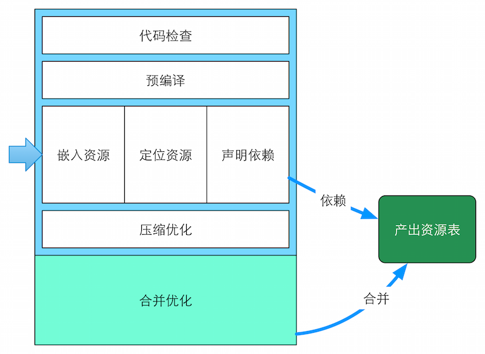

## 嵌入资源



FIS 三种语言能力之一，是对前端语言能力的延伸。在前端工程特别是移动端工程开发中，为了提升性能减少网络请求，都会对 css、js、图片进行内嵌。内嵌面临的一个问题是模板文件会越来越大，这时候不方便管理，更别谈拆分模块了。FIS 提供了内嵌能力，让前端不同语言以及同一种语言之间相互内嵌。来让这类问题得到解决，实现自由模块拆分。

### 在html中嵌入资源

> 在html中可以嵌入其他文件内容或者base64编码值，可以在资源定位的基础上，给资源加 **?__inline** 参数来标记资源嵌入需求。

* html中嵌入图片base64
    * 源码：

        ```html
        
        ```

    * 编译后

        ```html
        
        ```

* html中嵌入样式文件

    * 源码：

        ```html
        <link rel="stylesheet" type="text/css" href="demo.css?__inline">
        ```

    * 编译后

        ```html
        <style>img { border: 5px solid #ccc; }</style>
        ```

* html中嵌入脚本资源

    * 源码：

        ```html
        <script type="text/javascript" src="demo.js?__inline"></script>
        ```

    * 编译后

        ```html
        <script type="text/javascript">console.log('inline file');</script>
        ```

* html中嵌入页面文件

    * 源码（推荐使用）：

        ```html
        <link rel="import" href="demo.html?__inline">
        ```

    * 编译后

        ```html
        <!-- this is the content of demo.html -->
        <h1>demo.html content</h1>
        ```

    * 源码（功能同&lt;link ref="import" href="xxx?__inline"&gt;语法，此语法为**旧语法**，``不推荐使用`` ）：

        ```html
        <!--inline[demo.html]-->
        ```

    * 编译后

        ```html
        <!-- this is the content of demo.html -->
        <h1>demo.html content</h1>
        ```

### 在js中嵌入资源

> 在js中，使用编译函数 **__inline()** 来提供内容嵌入能力。可以利用这个函数嵌入图片的base64编码、嵌入其他js或者前端模板文件的编译内容， **这些处理对html中script标签里的内容同样有效**。

* 在js中嵌入js文件

    * 源码：

        ```javascript
        __inline('demo.js');
        ```

    * 编译后

        ```javascript
        console.log('demo.js content');
        ```

* 在js中嵌入图片base64

    * 源码：

        ```javascript
        var img = __inline('images/logo.gif');
        ```

    * 编译后：

        ```javascript
        var img = 'data:image/gif;base64,R0lGODlhDgGBALMAAGBn6eYxLvvy9PnKyfO...Jzna6853wjKc850nPeoYgAgA7';
        ```

* 在js中嵌入其他文本文件

    * 源码：

        ```javascript
        var css = __inline('a.css');
        ```

    * 编译后：

        ```javascript
        var css = "body \n{    color: red;\n}";
        ```

### 在css中嵌入资源

> 与html类似，凡是命中了资源定位能力的编译标记， **除了src="xxx"之外**，都可以通过添加 ``?__inline`` 编译标记都可以把文件内容嵌入进来。src="xxx"被用在ie浏览器支持的filter内，该属性不支持base64字符串，因此未做处理。

* 在css文件中嵌入其他css文件

    * 源码：

        ```css
        @import url('demo.css?__inline');
        ```

    * 编译后

        ```css
        img { border: 5px solid #ccc; };
        ```

* 在css中嵌入图片的base64

    * 源码：

        ```css
        .style {
            background: url(images/logo.gif?__inline);
        }
        ```

    * 编译后

        ```css
        .style {
            background: url(data:image/gif;base64,R0lGODlhDgGBALMAAGBn6eYxLvvy9PnKyfO...Jzna6853wjKc850nPeoYgAgA7);
        }
        ```